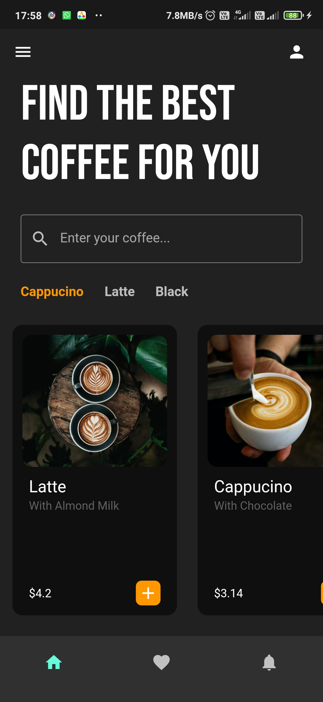

# Coffee App UI

Coffee App UI Design in flutter. I followed a youtube tutorial by Mitch Koko.  
Here's the [link](https://youtu.be/e8avvPPhyVk?si=J6IvhaueqHbjdyME  "coffee UI 👨🏽‍💻 cloning dribbble designs using FLUTTER ♡") to that video.

## The Design

Thank You For Visiting!